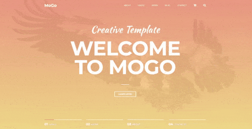

<h1><a href='https://mogohtml.netlify.app'>MOGO creative template</a></h1>
 

### О проекте
Репозиторий содержит простую лэндинг-страницу, разработанную с использованием HTML, SCSS и JavaScript. В процессе создания страницы применяются следующие техники:
* **Intersection Observers:** Для реализации интерактивного меню, реагирующего на прокрутку страницы.
* **DOM Property Manipulations:** Для управления свойствами элементов в реальном времени.
* **Библиотека Swiper:** Для создания красочных и интерактивных слайдеров.
* **Оптимизированная загрузка изображений:** Для улучшения производительности и быстрой загрузки контента.
* **Адаптивный дизайн:** Гарантирует корректное отображение на всех устройствах, включая телефоны, планшеты и настольные компьютеры.
* **Ленивая загрузка изображений:** Улучшает производительность страницы, загружая изображения только при необходимости.

Проект включает в себя интересные и визуально привлекательные анимации при прокрутке страницы, делая его более привлекательным для пользователей. Структура кода проста и эффективна, что упрощает его понимание и дальнейшие модификации.

 

 

### License
Distributed under the `MIT` License. See [LICENSE](https://github.com/kluevevga/Mogo/blob/master/LICENSE) for more information.
